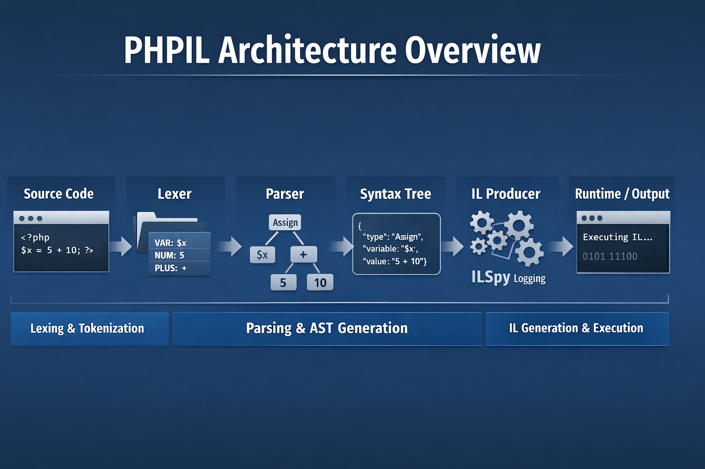

# PHPIL

**PHPIL** is a home-grown, experimental project designed purely for fun. It is a fast, modular PHP-inspired IL generation and execution engine built in C#.

This project explores building a full compiler/interpreter pipeline from scratch, including **lexing, parsing, syntax trees, and IL emission**. While entirely experimental, it demonstrates **efficient parsing and IL generation**, leveraging modern C# features like `ReadOnlySpan`, struct-based tokens, and byte enums to keep memory usage compact and performance high.



---

## Key Features

### 1. Lexer (`PHPIL.Engine.CodeLexer.Lexer`)

* Converts PHP-like source code into a **stream of compact tokens** (`Token` structs with `TokenKind` as a byte enum).
* Optimized for **memory and speed** using `ReadOnlySpan<char>` to avoid unnecessary allocations.
* **JIT compilation boosts performance:**

    * First parse of a large file takes ~3ms due to JIT
    * Subsequent parses of the same file are sub-millisecond
* Handles **strings, comments, variables, numbers, operators, punctuation, and keywords**.

### 2. Parser & Productions (`PHPIL.Engine.Productions`)

* Uses **combinator-style productions** for readable and maintainable parsing rules.
* Supports sequences, optional patterns, repetition, lookahead, and negative lookahead.
* Operates on **`ReadOnlySpan<Token>`**, making parsing **allocation-free and efficient**.
* Grammar is **still under development**, with new rules and constructs being added regularly.
* Operator precedence is handled; loops are still a work-in-progress.

### 3. Abstract Syntax Tree (AST) (`PHPIL.Engine.SyntaxTree`)

* **Nodes are self-contained** and know how to output themselves for a given visitor.
* Implements **Pratt-style parsing**, with accurate `Led` and `Nud` postfixing.
* Supports **JSON serialization** using `ToJson`, which is useful for tooling and debugging.
* Can be traversed using visitors for further processing.

### 4. IL Emission (`PHPIL.Engine.Visitors.IlProducer`)

* **`IlProducer`** traverses the AST and generates .NET IL for execution.
* Uses **`ILSpy`**, a logging wrapper for `ILGenerator` that outputs every emitted opcode, local, branch, and call — perfect for debugging.
* Syntax nodes emit IL according to the visitor provided, keeping the separation of concerns clean.
* Tracks **types on the stack** via `LastEmittedType` and maintains variable scope via `RuntimeContext`.
* Supports **DynamicMethod execution**, allowing emitted code to be run immediately.

---

## Performance

* Tokens are **structs**, `TokenKind` is a **byte enum**, and spans are used throughout for **compact memory representation**.
* Parsing is fast: after initial JIT overhead (~3ms for a large file), re-parsing is **sub-millisecond**.
* IL emission is **logged for debugging** without affecting runtime execution.

---

## Status & Roadmap

* The project is **experimental and still in development**.
* New grammar rules and productions are continually being added.
* Loops and some complex constructs are not fully implemented yet.
* Feedback, exploration, and experimentation are welcome.

---

## Usage

1. **Lex a source file**:

```csharp
var tokens = Lexer.ParseFile("example.php");
```

2. **Parse tokens into a syntax tree**:

```csharp
var rootNode = Parser.Parse(tokens, source.AsSpan());
```

3. **Generate IL**:

```csharp
var ilProducer = new IlProducer();
rootNode.Accept(ilProducer, source.AsSpan());
ilProducer.Execute();
```

4. **Inspect IL** (optional):

```csharp
Console.WriteLine(ilProducer.GetILGenerator().GetLog());
```

5. **Serialize AST**:

```csharp
var builder = new StringBuilder();
rootNode.ToJson(source.AsSpan(), tokens.AsSpan(), builder);
Console.WriteLine(builder.ToString());
```

---

## Conclusion

PHPIL is a **fun, fast, and educational project** exploring parsing, AST generation, and IL emission in C#. It demonstrates **modern C# memory efficiency**, **visitor-driven AST traversal**, and **debug-friendly IL generation**. While not production-ready, it provides a playground for experimentation with **language parsing and compilation techniques**.
